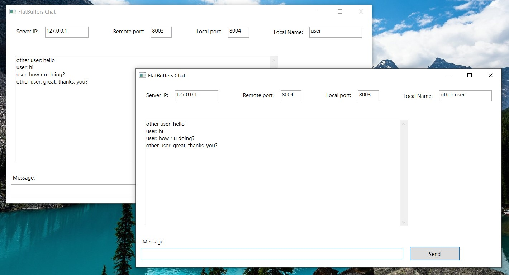

# FlatBuffers-Chat
Template of a chat application made using FlatBuffers serialization, a bit of .NET and WPF

In order to test it you need to run two instances of this app and make sure that remote port and local port are corresponding in each of them.
